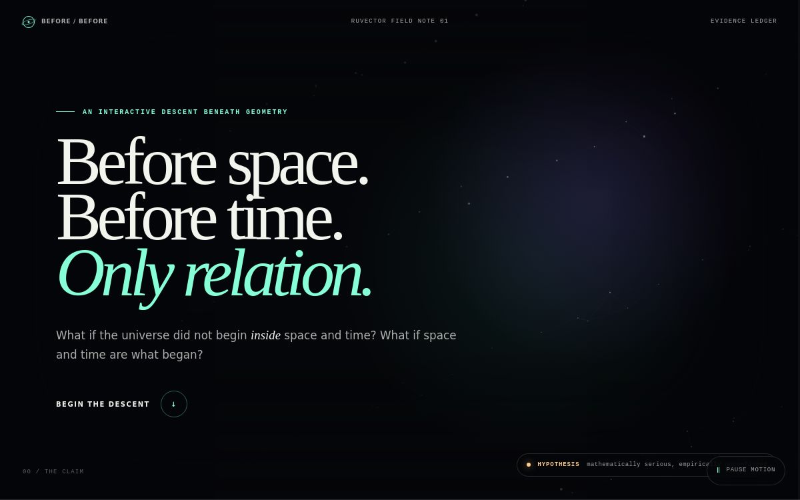

# Before Space, Before Time

Research notes and interactive thought experiments about the possibility that spacetime is emergent rather than fundamental.

[](https://before-space-before-time.ruv.chatgpt.site)

**[Launch the interactive site](https://before-space-before-time.ruv.chatgpt.site)**

## Abstract

Group Field Theory proposes quantum building blocks whose collective states can be interpreted as extended geometry. These building blocks do not occupy ordinary space. Under specific assumptions, condensate states can produce homogeneous cosmological dynamics, modified Friedmann equations, and effective bounce solutions.

This project converts those ideas into eight interactive thought experiments. The experience begins with primitive state containing identity, internal state, and relations, but no spatial coordinates and no universal clock. It then demonstrates how graph distance, effective dimension, relational change, phase coherence, and geometry like response can be derived.

The project establishes a constructive possibility. It does not establish that nature uses Group Field Theory or that spacetime is experimentally proven to be nonfundamental.

## Central claim

> A model can begin without coordinates or a global clock and still produce observables that behave like distance, dimension, geometry, and temporal order.

The claim is tested through a relabeling invariant:

1. Randomize every rendered coordinate.
2. Preserve the primitive graph and internal states.
3. Recompute relational distance, connectivity, spectral dimension, and event ordering.
4. Confirm that the derived observables remain unchanged within numerical tolerance.

If a derived observable changes only because the screen layout changed, the experiment assumed the geometry it claimed to derive.

## Research position

| Level | Status | Meaning |
| --- | --- | --- |
| Established | Strong empirical support | General relativity makes spacetime geometry dynamical. Quantum field theory and general relativity remain difficult to reconcile at fundamental scales. |
| Derived in model | Mathematical result under assumptions | GFT condensate states can yield homogeneous geometry and effective cosmological dynamics. |
| Interpretation | Plausible but nonunique | A condensate phase transition may represent geometrogenesis. |
| Open question | Unresolved | Whether our universe underwent this transition and which distinctive observation could confirm it. |

## Interactive experiments

| Scene | Question | Simple analogy |
| --- | --- | --- |
| Erase the stage | What remains after coordinates disappear? | Remove every street address but keep the map of connected doors. |
| One quantum | Can a geometric building block exist outside geometry? | One water molecule is not wet. |
| Cross the threshold | How can collective order produce a new phase? | A stadium wave belongs to the crowd, not one person. |
| Recover distance | Can nearness come from connection? | Two airports become one flight apart when a direct route opens. |
| Ask for dimension | Can dimension be measured rather than declared? | An ant infers thread, sheet, or room from how it can wander. |
| Build a clock | Can change measure change? | A dripping vessel can measure a growing plant without a wall clock. |
| Let geometry respond | Can the stage become part of the action? | Changing the road network changes every route through it. |
| Begin without a point | Can a singular beginning become a transition? | A system contracts to a smallest state and reverses. |

## RuVector research stack

* **RuVector** stores relational graph state and computes structural observables.
* **Emergent Time** represents relational clocks and change without a master timeline.
* **MidStream** records ordered state transitions for deterministic replay.
* **MetaHarness** runs seeded experiment ensembles and compares invariant outputs.
* **RVF** packages state, parameters, lineage, and witness history into a portable research receipt.

The browser edition implements deterministic graph routines directly. The production research path should bind the same contracts to the relevant RuVector WebAssembly components and record every run in a signed receipt.

## Repository structure

```text
.
├── README.md
├── assets
│   └── site-screenshot.jpg
├── docs
│   ├── 01_research_overview.md
│   ├── 02_theory_and_evidence.md
│   ├── 03_computational_model.md
│   ├── 04_experiment_protocols.md
│   ├── 05_limitations_and_falsifiability.md
│   └── references.md
└── presentations
    ├── Before_Space_Before_Time_Research.pptx
    └── README.md
```

## Acceptance test

Randomize the projection at least ten times. The relation fingerprint, graph distance between fixed endpoints, connected component count, and relational event order must remain unchanged. This is the minimum check that the experience derives geometry from relations rather than hiding coordinates in primitive state.

## Scientific caution

The largest risk is category error: a computational analogy can demonstrate logical possibility but cannot serve as evidence that the universe uses the same mechanism. Moving from illustration to physics requires equations, continuum recovery, compatibility with general relativity, distinctive predictions, and observational tests.

## Primary sources

See [docs/references.md](docs/references.md) for the complete research ledger.

